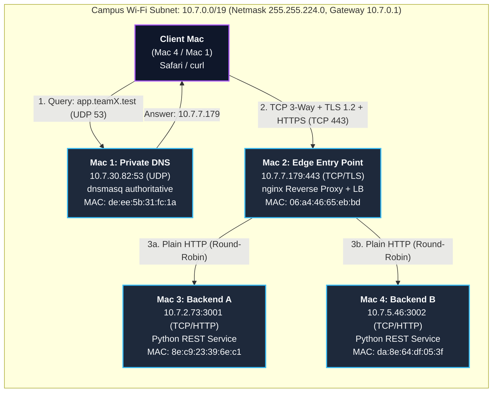
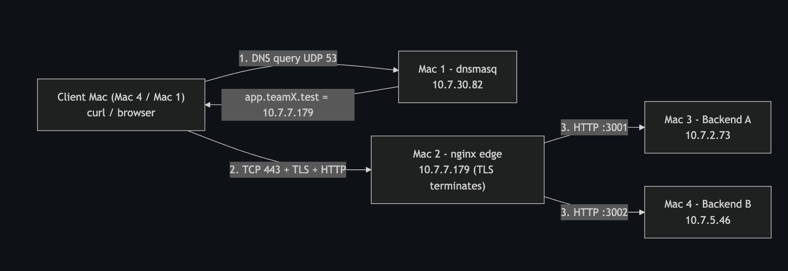
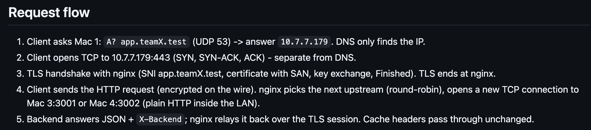

# Private Network Service Platform (Phase 1)

[](docs/ip-service-inventory.md)
[-blue?style=for-the-badge&logo=checkmarx)](docs/evidence-matrix.md)
[-success?style=for-the-badge&logo=letsencrypt)](tls/certificate-setup.md)
[](nginx/nginx.conf)
[-blueviolet?style=for-the-badge)](dns/team-dnsmasq.conf)

A production-grade, multi-node private network service platform deployed across **4 physical MacBooks** within a single campus Wi-Fi broadcast domain (`10.7.0.0/19`). 

This project explores computer networking from the physical and data link layers up to the application layer. The distributed architecture demonstrates private authoritative DNS, TLS-terminating reverse proxying, round-robin load balancing, HTTP/1.1 cache validation, packet forensics via Wireshark, and fault-injection diagnostics.

> *"The network is the project — the services exist to illuminate the protocols."*

---

## Table of Contents
1. [Logical & Physical Architecture](#logical--physical-architecture)
2. [Physical Host Inventory & Real Network Parameters](#physical-host-inventory--real-network-parameters)
3. [End-to-End Request Lifecycle](#end-to-end-request-lifecycle)
4. [OSI & TCP/IP Protocol Stack Mapping](#osi--tcpip-protocol-stack-mapping)
5. [Core Subsystems](#core-subsystems)
   - [1. LAN & L2/L3 Direct Delivery](#1-lan--l2l3-direct-delivery)
   - [2. Private Authoritative DNS (`dnsmasq`)](#2-private-authoritative-dns-dnsmasq)
   - [3. Edge Reverse Proxy & Load Balancer (`nginx`)](#3-edge-reverse-proxy--load-balancer-nginx)
   - [4. Private PKI & Trusted TLS Termination](#4-private-pki--trusted-tls-termination)
   - [5. REST Backends & HTTP Caching](#5-rest-backends--http-caching)
   - [6. Deep Packet Inspection (Wireshark PCAPs)](#6-deep-packet-inspection-wireshark-pcaps)
6. [Quick Start & Verification Runbook](#quick-start--verification-runbook)
7. [Failure Scenarios & Fault Isolation](#failure-scenarios--fault-isolation)
8. [Audited Evidence Matrix](#audited-evidence-matrix)
9. [Viva & Technical Interview Cheatsheet](#viva--technical-interview-cheatsheet)
10. [Repository Structure](#repository-structure)

---

## Logical & Physical Architecture

The client knows **only a single domain name** (`https://app.teamX.test`). The client machine never learns the private IP addresses of the backend application servers.





---

## Physical Host Inventory & Real Network Parameters

All 4 hosts operate on the **same Layer 2 / Layer 3 subnet**:
- **Subnet:** `10.7.0.0/19`
- **Subnet Mask:** `255.255.224.0` (Hexadecimal: `0xffffe000`, Prefix: `/19`)
- **Default Gateway:** `10.7.0.1`
- **Broadcast Address:** `10.7.31.255`
- **Interface:** `en0` (Wi-Fi)

| Mac | Member | Hostname | Assigned Role | IPv4 Address | Netmask | On-The-Air MAC (`ifconfig`) | Hardware MAC (`networksetup`) | Cloud Analogue |
|:---:|:---:|:---:|:---|:---:|:---:|:---:|:---:|:---|
| **1** | Aryan | `MacBook-Pro-88` | **Private DNS** + Verification Client | `10.7.30.82` | `255.255.224.0` (`/19`) | `de:ee:5b:31:fc:1a` | `10:9f:41:be:57:6d` | AWS Route 53 Private Hosted Zone |
| **2** | Ranajeet | `Ranajeets-MacBook-Pro` | **Edge Entry Point** (TLS Term + LB) | `10.7.7.179` | `255.255.224.0` (`/19`) | `06:a4:46:65:eb:bd` | `10:9f:41:bb:a2:9f` | AWS Application Load Balancer / CloudFront |
| **3** | Abhijeet | `Abhijeets-MacBook-Pro-3` | **Backend Instance A** | `10.7.2.73` | `255.255.224.0` (`/19`) | `8e:c9:23:39:6e:c1` | `10:9f:41:c0:b2:b1` | App Server EC2 / ECS Container A |
| **4** | Ankita | `Ankitas-MacBook-Pro` | **Backend Instance B** + Capture Client | `10.7.5.46` | `255.255.224.0` (`/19`) | `da:8e:64:df:05:3f` | `10:9f:41:c6:2a:38` | App Server EC2 / ECS Container B |

> **Why two MAC addresses per Mac?**  
> macOS implements *Private Wi-Fi Address* rotation, which randomizes the Layer-2 MAC on the air interface (`ifconfig en0 ether`). This is the address observed in Wireshark 802.11/Ethernet frame headers. The factory hardware MAC is burned into the NIC (`networksetup -getmacaddress Wi-Fi`). Both addresses are recorded and cross-verified for forensic auditing.

---

## End-to-End Request Lifecycle



When an end-user navigates to `https://app.teamX.test/api/status` or executes `curl -v https://app.teamX.test/api/status`:

```
[1. DNS Lookup]        Client  ---- UDP:53 ---->  Mac 1 (dnsmasq)       => 10.7.7.179
[2. TCP Handshake]     Client  <--- SYN/ACK --->  Mac 2 (nginx:443)     => Establishes TCP pipe
[3. TLS Negotiation]   Client  <--- TLS 1.2 --->  Mac 2 (edge.pem)      => Validates SAN & Root CA
[4. Encrypted Request] Client  ---- HTTPS ----->  Mac 2 (nginx)         => Terminated at Edge
[5. Load Balancing]    Mac 2   ---- HTTP:3001 ->  Mac 3 (Backend A)     => Round-robin dispatch
                       Mac 2   <--- JSON+Header-  Mac 3 (X-Backend: A)  => Relayed back
[6. Encrypted Return]  Client  <--- HTTPS ------  Mac 2                 => Delivered to browser
```

1. **DNS Query (UDP 53):** Client sends a standard DNS A-record query for `app.teamX.test` to Mac 1 (`10.7.30.82:53`). Mac 1 responds with Mac 2's IP (`10.7.7.179`). *DNS only translates names to IPs; it does not open a data connection.*
2. **TCP 3-Way Handshake (TCP 443):** Client initiates a reliable transport stream to `10.7.7.179:443` (`SYN` $\to$ `SYN-ACK` $\to$ `ACK`).
3. **TLS Handshake (TLS 1.2 / 1.3):** Client sends `ClientHello` with SNI `app.teamX.test`. Mac 2 returns `ServerHello`, its leaf certificate with matching Subject Alternative Name (SAN), and completes the key exchange (`Finished`). The client's OS keychain validates the cert against our committed `rootCA.pem`.
4. **HTTP Over TLS:** Client encrypts the HTTP `GET /api/status` request and sends it over the TLS record layer.
5. **Reverse Proxy & Upstream Balancing:** `nginx` decrypts the request, inspects the URL, and forwards it over plain HTTP across the private LAN to the next available backend in the round-robin pool (`10.7.2.73:3001` or `10.7.5.46:3002`).
6. **Response Relay:** The selected backend produces a JSON payload along with an identifying `X-Backend: A` or `X-Backend: B` header. `nginx` forwards the response back to the client over the secure TLS session. The client never communicates directly with the backend.

---

## OSI & TCP/IP Protocol Stack Mapping

| Layer | OSI Model | TCP/IP Model | Protocol / Technology | Port / Scope | Implementation in Project |
|:---:|:---|:---|:---|:---|:---|
| **7** | Application | Application | **HTTP/1.1** & **DNS** | TCP 443 / UDP 53 | REST JSON APIs, `X-Backend` header, `Cache-Control`, `ETag`, `dnsmasq` queries |
| **6** | Presentation | Application | **TLS 1.2 / 1.3** | TCP 443 | Encryption, session keys, SAN certificate validation via local PKI |
| **5** | Session | Application | **TLS Session** | Layer 5/6 boundary | Session establishment, resumption, and termination at the Edge |
| **4** | Transport | Transport | **TCP** & **UDP** | 443, 3001, 3002 (TCP), 53 (UDP) | 3-way handshake, sequence/ACK numbers, flow control, connectionless DNS |
| **3** | Network | Internet | **IPv4** & **ICMP** | Subnet `10.7.0.0/19` | Direct L2/L3 packet routing, ARP resolution, ICMP echo reachability |
| **2** | Data Link | Network Access | **IEEE 802.11 / Ethernet** | MAC Addressing | On-air frames (`de:ee:...`, `06:a4:...`), ARP tables, BSSID |
| **1** | Physical | Network Access | **Wi-Fi RF Channel** | 2.4 GHz / 5 GHz | Radio frequency transmission over campus wireless access points |

---

## Core Subsystems

### 1. LAN & L2/L3 Direct Delivery
- Every machine computes its network address: `IP & Netmask = 10.7.0.0/19`.
- Because all four machines share the exact same subnet prefix (`10.7.0.0/19`), packets are **delivered directly at Layer 2 via ARP** without traversing the default gateway router (`10.7.0.1`).
- Verified via [scripts/verify-lan.sh](file:///Users/aryankumar/Desktop/CN/scripts/verify-lan.sh), which performs a 4-node mutual ping matrix.

### 2. Private Authoritative DNS (`dnsmasq`)
- Configured in [dns/team-dnsmasq.conf](file:///Users/aryankumar/Desktop/CN/dns/team-dnsmasq.conf).
- Listens exclusively on `127.0.0.1` and `10.7.30.82` (Mac 1).
- `no-resolv` and `no-hosts` ensure no leakage from `/etc/resolv.conf` or local `/etc/hosts` files.
- `local=/teamX.test/` guarantees that queries for our domain are answered authoritatively and never leaked to external upstreams (`10.5.7.1` or `8.8.8.8`).
- Uses `.test` (RFC 6761 reserved domain) to prevent clashes with Apple Bonjour/mDNS (`.local`).

### 3. Edge Reverse Proxy & Load Balancer (`nginx`)
- Configured in [nginx/nginx.conf](file:///Users/aryankumar/Desktop/CN/nginx/nginx.conf).
- Terminates TLS on port `443` using modern cipher suites.
- Upstream pool `app_pool` balances requests across Backends A and B using default **Round-Robin**:
  ```nginx
  upstream app_pool {
      server 10.7.2.73:3001 max_fails=1 fail_timeout=5s;
      server 10.7.5.46:3002 max_fails=1 fail_timeout=5s;
  }
  ```
- Passive failover: `proxy_next_upstream error timeout` instantly routes a request to the surviving backend if one node drops, with zero downtime experienced by the client.

### 4. Private PKI & Trusted TLS Termination
- Created using `mkcert` (faculty-approved local CA). Detailed steps documented in [tls/certificate-setup.md](file:///Users/aryankumar/Desktop/CN/tls/certificate-setup.md).
- Root CA (`rootCA.pem`) imported into the macOS **System Keychain** under `Always Trust` on all peer Macs.
- Leaf certificate contains Subject Alternative Names (SAN) for both `app.teamX.test` and `api.teamX.test`.
- Enables pristine HTTPS access in Safari and `curl` **without `-k` or `--insecure` flags**.

### 5. REST Backends & HTTP Caching
- Implemented in [backend/server.py](file:///Users/aryankumar/Desktop/CN/backend/server.py) using Python's standard library `ThreadingHTTPServer`.
- Binds to `0.0.0.0` (all interfaces) so traffic forwarded by `nginx` from Mac 2 is accepted.
- Includes `/api/cache` endpoint demonstrating HTTP conditional caching:
  - Header: `Cache-Control: max-age=60`
  - Validator: `ETag: "phase1-cache-v1"`
  - Conditional Request: When client sends `If-None-Match: "phase1-cache-v1"`, backend returns **`304 Not Modified`** without payload body, saving network bandwidth.

### 6. Deep Packet Inspection (Wireshark PCAPs)
Forensic packet captures saved in `evidence/07_WIRESHARK/`:
1. **`07_WIRESHARK_DNS.png`**: UDP 53 query and answer displaying ephemeral client port and authoritative response `10.7.7.179`.
2. **`07_WIRESHARK_TCP_handshake.png`**: 3-way handshake (`SYN`, `SYN-ACK`, `ACK`) with relative and raw 32-bit sequence numbers.
3. **`07_WIRESHARK_TLS_handshake.png`**: ClientHello (listing cipher suites & SNI), ServerHello, Server Certificate, Key Exchange, and Finished.
4. **`07_WIRESHARK_encrypted_data.png`**: TLS record layer `content_type==23` (Application Data), proving plaintext payloads cannot be intercepted on the air.
5. **`07_WIRESHARK_backend_hop_3001_3002.png`**: Captured on Mac 2, showing decrypted plain HTTP communication with backend instances on ports 3001/3002 inside the private LAN.
6. **Committed Raw PCAPs**: [client_full_tls12.pcap](file:///Users/aryankumar/Desktop/CN/evidence/07_WIRESHARK/client_full_tls12.pcap), [edge_to_backends_part1.pcapng](file:///Users/aryankumar/Desktop/CN/evidence/07_WIRESHARK/edge_to_backends_part1.pcapng), and [edge_to_backends_part2.pcapng](file:///Users/aryankumar/Desktop/CN/evidence/07_WIRESHARK/edge_to_backends_part2.pcapng).

---

## Quick Start & Verification Runbook

### Prerequisites
- macOS on all nodes with `brew` installed.
- Required software: `dnsmasq` (Mac 1), `nginx` & `mkcert` (Mac 2), `python3` (Mac 3 & 4), `wireshark` / `tshark` (Mac 4).

### Step 1: Environment & Config Synchronization
On every Mac, pull the latest repository:
```bash
git pull origin main
```
Review or update [env.sh](file:///Users/aryankumar/Desktop/CN/env.sh) if DHCP addresses change, then regenerate configuration files:
```bash
./scripts/render-configs.sh
```

### Step 2: Service Launch Order
1. **Mac 1 (DNS Authority):**
   ```bash
   sudo dnsmasq -C dns/team-dnsmasq.conf -d
   ```
2. **Mac 2 (Edge Reverse Proxy):**
   ```bash
   sudo "$(brew --prefix)/bin/nginx" -c "$PWD/nginx/nginx.conf"
   ```
3. **Mac 3 (Backend A):**
   ```bash
   ./backend/run-backend-a.sh
   ```
4. **Mac 4 (Backend B):**
   ```bash
   ./backend/run-backend-b.sh
   ```

### Step 3: Configure Client Resolvers
On client Macs (e.g. Mac 4 or Mac 1):
```bash
sudo networksetup -setdnsservers Wi-Fi 10.7.30.82
sudo dscacheutil -flushcache; sudo killall -HUP mDNSResponder
```

### Step 4: Run Automated Verification Suite
Run the test scripts from any client Mac:
```bash
# 1. Verify LAN, subnet mask (/19), gateway, MACs, and ping matrix:
./scripts/verify-lan.sh

# 2. Verify DNS resolution via Mac 1:
./scripts/verify-dns.sh

# 3. Verify Edge TLS, Round-Robin Balancing, and Caching:
./scripts/verify-edge.sh

# 4. Verify Direct Backend Reachability:
./scripts/verify-backends.sh
```

---

## Failure Scenarios & Fault Isolation

Our design isolates faults bottom-up across the network stack. All 5 failure demos were executed, captured, and verified:

| # | Injected Failure | Fault Layer | Trigger Method | Client Symptom / Evidence | Root Cause Explanation |
|:---:|:---|:---:|:---|:---|:---|
| **1** | **Wrong DNS Resolver** | L7 (DNS) | Client points to `8.8.8.8` instead of `10.7.30.82` | `Could not resolve host: app.teamX.test` ([Evidence](evidence/08_FAILURES/08_FAILURE_wrong_dns.png)) | Public upstream resolvers do not possess authority for the private `.test` zone. |
| **2** | **Wrong Edge IP** | L3 (Network) | Querying `10.7.7.250` directly | `Host is down` or `Connection timed out` ([Evidence](evidence/08_FAILURES/08_FAILURE_wrong_ip.png)) | ARP requests for an unassigned IP go unanswered; no MAC binding exists. |
| **3** | **Backend A Down** | L7 (Upstream) | Stop `Backend A` (`Ctrl+C` on Mac 3) | 100% of requests routed to `Backend B` ([Evidence](evidence/08_FAILURES/08_FAILURE_backend_down.png)) | `nginx` passive failover detects connection failure and transparently retries Backend B. |
| **4** | **Both Backends Down** | L7 (Application) | Stop both `Backend A` and `Backend B` | `HTTP/1.1 502 Bad Gateway` ([Evidence](evidence/08_FAILURES/08_FAILURE_both_backends_down.png)) | The reverse proxy establishes TCP to client, but has zero live upstreams to fulfill the request. |
| **5** | **Wrong Service Port** | L4 (Transport) | Requesting `https://app.teamX.test:8443` | `Connection refused` ([Evidence](evidence/08_FAILURES/08_FAILURE_wrong_port.png)) | No process is listening on TCP port 8443; the OS sends a TCP `RST` flag back. |

---

## Audited Evidence Matrix

All evidence artifacts are stored under `evidence/` and audited in [docs/evidence-matrix.md](file:///Users/aryankumar/Desktop/CN/docs/evidence-matrix.md):

| Category | Folder | Key Artifacts | Audit Status |
|:---|:---|:---|:---:|
| **LAN & IPs** | `evidence/01_LAN/` | IP inventories & ping matrices for Aryan, Ranajeet, Abhijeet, Ankita; topology diagram | `[x] 100% Present` |
| **DNS** | `evidence/02_DNS/` | `dnsmasq.conf`, resolver screenshots for all 3 clients, `dig app`, `dig api`, `nslookup`, server logs | `[x] 100% Present` |
| **Backends** | `evidence/03_BACKENDS/` | `lsof` listener proofs (`*:3001`, `*:3002`), curl `/api/status`, cross-Mac connectivity proofs | `[x] 100% Present` |
| **NGINX Edge** | `evidence/04_NGINX/` | Upstream config snippet, 8-request round-robin alternation, access logs recording upstream IPs | `[x] 100% Present` |
| **TLS & PKI** | `evidence/05_TLS/` | System Keychain root CA trust screenshots on all Macs, SAN verification, clean curl without `-k`, Safari padlock | `[x] 100% Present` |
| **Caching** | `evidence/06_CACHE/` | `Cache-Control` + `ETag` headers, conditional `304 Not Modified` curl, DevTools Network panel states | `[x] 100% Present` |
| **Wireshark** | `evidence/07_WIRESHARK/` | DNS UDP capture, TCP 3-way handshake, TLS 1.2 handshake, encrypted data record, edge-to-backend hop, raw PCAPs | `[x] 100% Present` |
| **Failures** | `evidence/08_FAILURES/` | 5 injected failure screenshots (wrong DNS, wrong IP, backend down, both down, wrong port) | `[x] 100% Present` |

---

## Viva & Technical Interview Cheatsheet

<details>
<summary><b>1. Why does Mac 2 serve as the sole entry point instead of clients reaching backends directly?</b></summary>
<br>
Decoupling and defense-in-depth. Hiding backend IPs allows the application fleet to scale, migrate, or fail over without changing client DNS or configuration. Centralizing TLS at the edge offloads crypto computation from application nodes, eliminates distributing private keys across multiple servers, and limits the exposed surface to a single hardened reverse proxy.
</details>

<details>
<summary><b>2. Why did we choose <code>.test</code> instead of <code>.local</code> for our domain?</b></summary>
<br>
RFC 6761 reserves <code>.test</code> specifically for private testing without collision with public DNS. In contrast, RFC 6762 reserves <code>.local</code> for Multicast DNS (mDNS / Apple Bonjour). Under macOS, querying a <code>.local</code> domain triggers local link-local multicast (224.0.0.251 / UDP 5353) instead of unicast DNS (UDP 53) to our designated nameserver, causing resolution delays or outright failures.
</details>

<details>
<summary><b>3. Does a successful <code>ping</code> prove that the web application is healthy?</b></summary>
<br>
No. <code>ping</code> uses ICMP Echo Request / Echo Reply (Layer 3 / Network Layer). It confirms that the destination IP exists, the network route is valid, and the host's OS kernel network stack is responding. It does not test Layer 4 (whether a TCP port is open or listening) or Layer 7 (whether <code>nginx</code> or <code>server.py</code> is running and returning valid HTTP responses).
</details>

<details>
<summary><b>4. What is the difference between an on-the-air MAC address and a hardware MAC?</b></summary>
<br>
macOS enables "Private Wi-Fi Address" by default, which generates a pseudo-randomized MAC address for each wireless SSID to prevent physical device tracking across Wi-Fi networks. This randomized MAC appears in the 802.11 radio frames and Wireshark captures (<code>ifconfig en0 ether</code>). The permanent hardware MAC burned into the network interface controller is viewed via <code>networksetup -getmacaddress Wi-Fi</code>.
</details>

<details>
<summary><b>5. How does Round-Robin balancing differ from Least Connections or IP Hash?</b></summary>
<br>
Round-robin iterates sequentially across the upstream list ($A \to B \to A \to B$). It is stateless and optimal when upstream servers are identical and request execution times are uniform. Least Connections forwards requests to the node with the fewest active connections (better for long-lived transactions). IP Hash hashes the client IP to pin sessions to a specific server (session persistence).
</details>

<details>
<summary><b>6. What happens during an HTTP 304 conditional request?</b></summary>
<br>
When a client requests a resource with an <code>ETag</code>, it stores the validator token. On subsequent requests, it sends <code>If-None-Match: "phase1-cache-v1"</code>. The server compares the token with the current asset. If unchanged, it sends an empty-body <code>304 Not Modified</code> with headers only. This saves bandwidth and reduces server processing while ensuring data freshness.
</details>

<details>
<summary><b>7. Why is the Subject Alternative Name (SAN) critical in modern TLS certificates?</b></summary>
<br>
RFC 6125 and modern browsers (Chrome, Safari) deprecate validating hostnames against the Subject Common Name (CN). Browsers now strictly enforce that the requested hostname must appear in the Subject Alternative Name (SAN) extension. If a cert has <code>CN=app.teamX.test</code> without an explicit SAN, modern TLS stacks will reject the connection as untrusted.
</details>

<details>
<summary><b>8. What ensures reliability and ordering in the TCP 3-way handshake?</b></summary>
<br>
Sequence numbers (SYN consumes 1 sequence number). Both client and server select an Initial Sequence Number (ISN). The acknowledgment number (ACK) indicates the next byte expected. Cumulative ACKs and sliding window flow control guarantee reliable, in-order, duplicate-free data delivery over an unreliable network.
</details>

<details>
<summary><b>9. How does <code>nginx</code> passive health checking operate?</b></summary>
<br>
We configure <code>max_fails=1 fail_timeout=5s</code> alongside <code>proxy_next_upstream error timeout</code>. If a request to Backend A fails to connect or times out within 2 seconds, <code>nginx</code> automatically dispatches the identical request to Backend B, marks Backend A temporarily down for 5 seconds, and transparently returns Backend B's response to the client with zero HTTP errors observed.
</details>

<details>
<summary><b>10. Why must backends bind to <code>0.0.0.0</code> instead of <code>127.0.0.1</code>?</b></summary>
<br>
Binding to <code>127.0.0.1</code> restricts the socket to the local loopback interface (inter-process communication on the same physical Mac). Binding to <code>0.0.0.0</code> instructs the operating system to listen on all IPv4 interfaces, enabling inbound TCP SYN packets across the LAN from Mac 2 (the edge reverse proxy).
</details>

---

## Disaster Recovery & Rollback

To return all machines to standard configuration:
- **Reset Client DNS:**
  ```bash
  sudo networksetup -setdnsservers Wi-Fi empty
  sudo dscacheutil -flushcache; sudo killall -HUP mDNSResponder
  ```
- **Stop DNS Server (Mac 1):** Stop `dnsmasq` process (`Ctrl+C` or `sudo pkill dnsmasq`).
- **Stop Reverse Proxy (Mac 2):**
  ```bash
  sudo "$(brew --prefix)/bin/nginx" -c "$PWD/nginx/nginx.conf" -s stop
  ```
- **Uninstall Local CA Trust:**
  ```bash
  sudo security remove-trusted-cert -d tls/rootCA.pem
  ```
  *(On Mac 2, also run `mkcert -uninstall`)*.
- **Stop Backends (Mac 3 & 4):** Stop running Python instances (`Ctrl+C` or `pkill -f server.py`).

---

## Repository Structure

```
.
├── README.md                      # Comprehensive project documentation
├── env.sh                         # Single source of truth (IPs, Masks, MACs, Ports)
├── backend/
│   ├── run-backend-a.sh           # Backend A runner (Mac 3 :3001)
│   ├── run-backend-b.sh           # Backend B runner (Mac 4 :3002)
│   └── server.py                  # Multi-threaded REST service (JSON + ETag caching)
├── dns/
│   └── team-dnsmasq.conf          # Authoritative DNS configuration for teamX.test
├── nginx/
│   └── nginx.conf                 # Edge reverse proxy, TLS termination & LB config
├── scripts/
│   ├── render-configs.sh          # Compiles dnsmasq and nginx configs from env.sh
│   ├── verify-lan.sh              # Audits subnet mask (/19), MACs & ping matrix
│   ├── verify-dns.sh              # Tests authoritative DNS resolution
│   ├── verify-backends.sh         # Direct backend diagnostic reachability
│   ├── verify-edge.sh             # Tests HTTPS edge, load balancing & caching
│   └── save-shot.sh               # Helper for capturing evidence screenshots
├── tls/
│   ├── certificate-setup.md       # Step-by-step local PKI & certificate runbook
│   └── rootCA.pem                 # Public Root CA certificate trusted on all nodes
├── docs/
│   ├── architecture.md            # Deep dive into network topology & request flow
│   ├── ip-service-inventory.md    # Host inventory, verified masks & MAC tables
│   ├── evidence-matrix.md         # Complete 28-item audit matrix (100% verified)
│   ├── DEMO_AND_CHECKLISTS.md     # Faculty presentation script & demo runbook
│   ├── topology.png               # High-res logical network diagram
│   └── request-flow.png           # High-res step-by-step lifecycle diagram
└── evidence/                      # Audited proof artifacts
    ├── 01_LAN/                    # Subnet /19, MAC inventories & ping matrices
    ├── 02_DNS/                    # DNS records, client resolver proofs & server logs
    ├── 03_BACKENDS/               # Listener sockets & status responses
    ├── 04_NGINX/                  # Upstream config, access logs & round-robin proofs
    ├── 05_TLS/                    # Keychain root trust, SAN proof & browser padlock
    ├── 06_CACHE/                  # ETag, 304 Not Modified & DevTools network states
    ├── 07_WIRESHARK/              # Handshake dissection & raw .pcap/.pcapng traces
    └── 08_FAILURES/               # 5 isolated fault injection proofs
```

---

<div align="center">
  <b>Computer Networks Laboratory &copy; 2026</b><br/>
  <i>Engineered by Aryan Kumar, Ranajeet Roy, Abhijeet Kumar, and Ankita Thakur</i>
</div>
