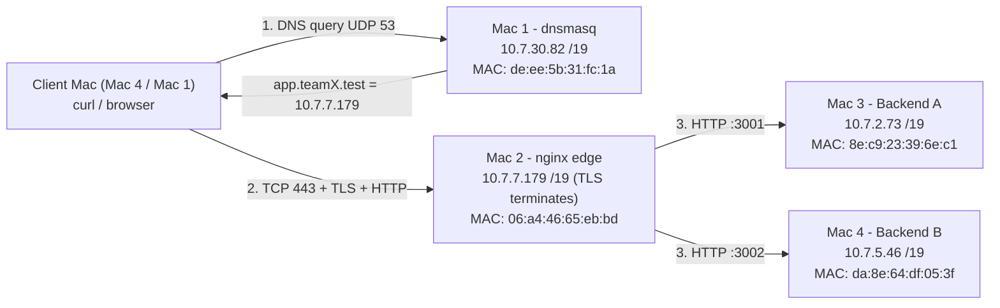

# Architecture - Phase 1 (Private Network Service Platform)

## Topology (one L2/L3 segment: campus Wi-Fi 10.7.0.0/19, mask 255.255.224.0, gateway 10.7.0.1)

```
 Client --DNS(UDP53)--> Mac1 dnsmasq (10.7.30.82)         (answer: Mac2 IP 10.7.7.179)
 Client --TCP+TLS+HTTP(443)--> Mac2 nginx (10.7.7.179) --HTTP:3001--> Mac3 Backend A (10.7.2.73)
                                                       \--HTTP:3002--> Mac4 Backend B (10.7.5.46)
 Subnet: 10.7.0.0/19 | Netmask: 255.255.224.0 (0xffffe000) | Gateway: 10.7.0.1 | Broadcast: 10.7.31.255
```
All four Macs sit on the same Wi-Fi subnet; the diagram above is the logical service topology.

## Machine roles & Real Network Identifiers
| Mac | Person | Hostname | Role | IPv4 | Netmask (/Prefix) | Gateway | MAC (on the air) | MAC (hardware) | Cloud equivalent |
|---|---|---|---|---|---|---|---|---|---|
| 1 | Aryan | `MacBook-Pro-88` | Private DNS + test client | 10.7.30.82 | 255.255.224.0 (`/19`) | 10.7.0.1 | `de:ee:5b:31:fc:1a` | `10:9f:41:be:57:6d` | Route 53 (private hosted zone) |
| 2 | Ranajeet | `Ranajeets-MacBook-Pro` | Edge: TLS termination, reverse proxy, load balancer | 10.7.7.179 | 255.255.224.0 (`/19`) | 10.7.0.1 | `06:a4:46:65:eb:bd` | `10:9f:41:bb:a2:9f` | AWS ALB / CloudFront edge |
| 3 | Abhijeet | `Abhijeets-MacBook-Pro-3` | Backend A | 10.7.2.73 | 255.255.224.0 (`/19`) | 10.7.0.1 | `8e:c9:23:39:6e:c1` | `10:9f:41:c0:b2:b1` | App server instance A (EC2/ECS task) |
| 4 | Ankita | `Ankitas-MacBook-Pro` | Backend B + client | 10.7.5.46 | 255.255.224.0 (`/19`) | 10.7.0.1 | `da:8e:64:df:05:3f` | `10:9f:41:c6:2a:38` | App server instance B |

## Request flow
1. Client asks Mac 1: `A? app.teamX.test` (UDP 53) -> answer `10.7.7.179`. DNS only finds the IP.
2. Client opens TCP to 10.7.7.179:443 (SYN, SYN-ACK, ACK) - separate from DNS.
3. TLS handshake with nginx (SNI app.teamX.test, certificate with SAN, key exchange, Finished). TLS ends at nginx.
4. Client sends the HTTP request (encrypted on the wire). nginx picks the next upstream (round-robin), opens a new TCP connection to Mac 3:3001 or Mac 4:3002 (plain HTTP inside the LAN).
5. Backend answers JSON + `X-Backend`; nginx relays it back over the TLS session. Cache headers pass through unchanged.

## Protocol / layer mapping
| Item | OSI | TCP/IP | Details / Ports / Addresses |
|---|---|---|---|
| HTTP/1.1 REST, DNS | 7 Application | Application | JSON payloads, ETag caching, UDP 53 DNS queries |
| TLS 1.2 / 1.3 | 6/5 (presentation/session) | Application (over TCP) | TCP 443; terminated on Mac 2 (`edge.pem`) |
| TCP / UDP | 4 Transport | Transport | TCP 443 (edge), TCP 3001/3002 (backends), UDP 53 (DNS) |
| IPv4 | 3 Network | Internet | Subnet **10.7.0.0/19**, Mask **255.255.224.0** (`0xffffe000`), Gateway **10.7.0.1** |
| Data Link (MAC) | 2 Data link | Link | 802.11 Wi-Fi frames with on-air MACs (`de:ee:..`, `06:a4:..`, `8e:c9:..`, `da:8e:..`) |
| Physical | 1 Physical | Link | Wi-Fi 2.4 GHz / 5 GHz RF channel |

## Why clients never use backend IPs
Clients know only a name. DNS maps the name to the edge. The edge hides, scales and replaces backends (add/remove/failover) with zero client change, centralises TLS, and is the only thing exposed (smaller attack surface). Same idea as DNS -> load balancer -> target group in the cloud.

## Key design decisions
- Subnet: `10.7.0.0/19` with netmask `255.255.224.0` (all 4 Macs reside on the same broadcast domain).
- `.test` (RFC 6761 reserved), not `.local` (mDNS conflict on macOS).
- nginx default round-robin over `upstream app_pool`; passive failover (`max_fails`, `proxy_next_upstream`).
- TLS: mkcert local CA (faculty-approved), leaf SAN = app.teamX.test + api.teamX.test, CA trusted in the System keychain on every Mac.
- Backends bind 0.0.0.0 (LAN reachable), fixed ports 3001/3002.
- Caching: `/api/cache` -> `Cache-Control: max-age=60` + `ETag: "phase1-cache-v1"`; matching `If-None-Match` -> 304.
