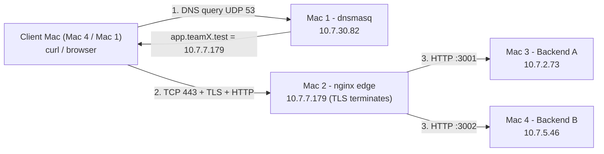

# Architecture - Phase 1 (Private Network Service Platform)

## Topology (one L2/L3 segment: campus Wi-Fi 10.7.0.0/19, gateway 10.7.0.1)

```
 Client --DNS(UDP53)--> Mac1 dnsmasq        (answer: Mac2 IP)
 Client --TCP+TLS+HTTP(443)--> Mac2 nginx --HTTP:3001--> Mac3 Backend A
                                         \--HTTP:3002--> Mac4 Backend B
```
All four Macs sit on the same Wi-Fi; the diagram above is the logical service topology.

## Machine roles
| Mac | Role | Software | Cloud equivalent |
|---|---|---|---|
| 1 | Private DNS + test client | dnsmasq, dig, curl | Route 53 (private hosted zone) |
| 2 | Edge: TLS termination, reverse proxy, load balancer | nginx, mkcert cert | AWS ALB / CloudFront edge |
| 3 | Backend A | Python REST :3001 | App server instance A (EC2/ECS task) |
| 4 | Backend B + client | Python REST :3002 | App server instance B |

## Request flow
1. Client asks Mac 1: `A? app.teamX.test` (UDP 53) -> answer `10.7.7.179`. DNS only finds the IP.
2. Client opens TCP to 10.7.7.179:443 (SYN, SYN-ACK, ACK) - separate from DNS.
3. TLS handshake with nginx (SNI app.teamX.test, certificate with SAN, key exchange, Finished). TLS ends at nginx.
4. Client sends the HTTP request (encrypted on the wire). nginx picks the next upstream (round-robin), opens a new TCP connection to Mac 3:3001 or Mac 4:3002 (plain HTTP inside the LAN).
5. Backend answers JSON + `X-Backend`; nginx relays it back over the TLS session. Cache headers pass through unchanged.

## Protocol / layer mapping
| Item | OSI | TCP/IP | Port |
|---|---|---|---|
| HTTP/1.1 REST, DNS | 7 Application | Application | - |
| TLS | 6/5 (presentation/session; sits between TCP and HTTP) | Application (over TCP) | 443 |
| TCP / UDP | 4 Transport | Transport | TCP 443/3001/3002, UDP 53 |
| IPv4 (10.7.x.x) | 3 Network | Internet | - |
| Wi-Fi/Ethernet frames, MAC | 2 Data link | Link | - |
| Radio | 1 Physical | Link | - |

## Why clients never use backend IPs
Clients know only a name. DNS maps the name to the edge. The edge hides, scales and replaces backends (add/remove/failover) with zero client change, centralises TLS, and is the only thing exposed (smaller attack surface). Same idea as DNS -> load balancer -> target group in the cloud.

## Key design decisions
- `.test` (RFC 6761 reserved), not `.local` (mDNS conflict on macOS).
- nginx default round-robin over `upstream app_pool`; passive failover (`max_fails`, `proxy_next_upstream`).
- TLS: mkcert local CA (faculty-approved), leaf SAN = app.teamX.test + api.teamX.test, CA trusted in the System keychain on every Mac.
- Backends bind 0.0.0.0 (LAN reachable), fixed ports 3001/3002.
- Caching: `/api/cache` -> `Cache-Control: max-age=60` + `ETag: "phase1-cache-v1"`; matching `If-None-Match` -> 304.
